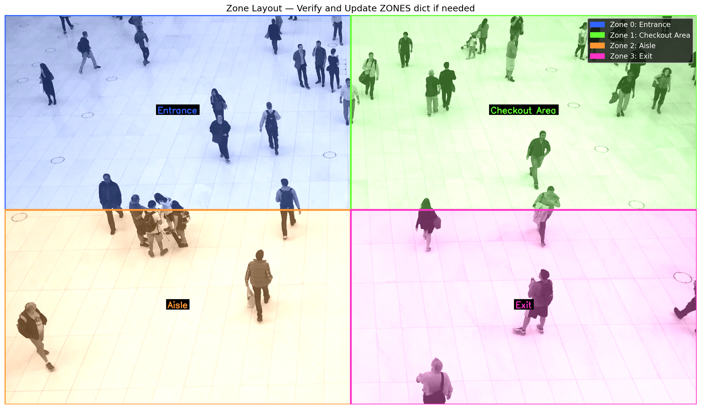
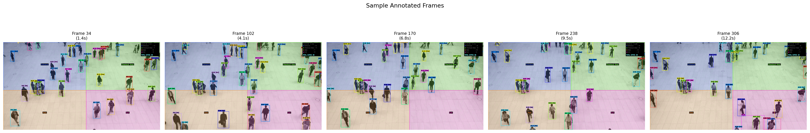
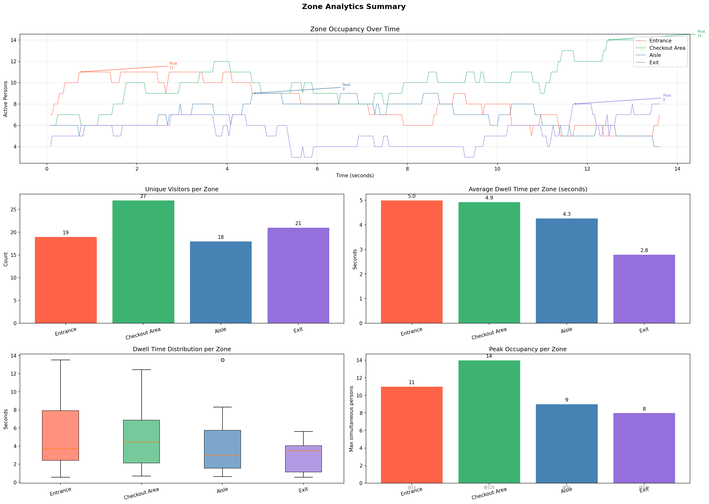

# Real-Time People Tracking and Zone-Based Occupancy Analytics

This project tracks people in a video with YOLOv8 and DeepSORT, assigns each tracked person to one of four manually defined zones, and turns the results into zone-level occupancy analytics. The final output includes an annotated video, structured summary files, and a frame-by-frame occupancy log.

## What the project does

The pipeline is split into four phases:

1. **Detection & Tracking** - YOLOv8 detects people and DeepSORT keeps persistent track IDs across frames.
2. **Zone Definition** - four meaningful zones are drawn on the frame and named according to the scene.
3. **Analytics** - the project measures live occupancy, unique visitors, dwell time, and peak occupancy for every zone.
4. **Output** - the project exports an annotated video plus CSV and JSON analytics files.

If you are using the included notebooks, run them in order from `notebooks/Phase1.ipynb` through `notebooks/Phase4.ipynb`.

### Main dependencies

- `ultralytics`
- `deep_sort_realtime`
- `opencv-python-headless`
- `numpy`
- `pandas`
- `matplotlib`
- `scipy`

## Input and Output Videos are stored here:
[Google Drive link](https://drive.google.com/drive/folders/16dTfGVoT8Mewqpl3i1KBLxIRKOaIcjj7?usp=sharing)

## Phase 1 - Detection & Tracking

For detection, I used **YOLOv8m** (`notebooks/yolov8m.pt`) and filtered detections to the person class only. For tracking, I used **DeepSORT** so each person keeps the same ID across frames whenever possible.

The tracker settings were chosen to keep IDs stable in a moderately crowded scene:

- `max_age = 30`
- `min_hits = 3`
- `iou_threshold = 0.30`
- `cosine_distance = 0.30`

Why these values:

- `max_age=30` lets a track survive short occlusions without being dropped too quickly.
- `min_hits=3` avoids confirming noisy detections too early.
- `iou_threshold=0.30` keeps the association rule permissive enough for moving people.
- `cosine_distance=0.30` helps preserve identity using appearance features when motion alone is not enough.

The run produced **66 unique track IDs** and an estimated **29 ID switches** in the processed video. Most of the remaining switches happened when people overlapped or briefly disappeared behind others.

## Phase 2 - Zone Definition

I defined four zones directly on the first frame and gave them names that match the visual layout of the footage:

- **Zone 0: Entrance**
- **Zone 1: Checkout Area**
- **Zone 2: Aisle**
- **Zone 3: Exit**

Zone membership is determined from the tracked person's **bottom-center point**, which is a better proxy for where the person is standing than the center of the bounding box.

If a point lands on the edge between two zones, the project uses a simple and consistent rule: **first match wins**. In practice, that means the zones are checked in the order they appear in the zone list, and the first matching polygon is used.

### Labeled zone layout



## Phase 3 - Analytics

For each zone, the project computes:

- **Live occupancy count**
- **Total unique visitors**
- **Average dwell time**
- **Peak occupancy** and the timestamp when it occurred

The dwell-time logic ignores extremely short visits under `0.5` seconds, which helps reduce noise from boundary flicker and accidental one-frame touches.

### Final zone summary

| Zone | Unique Visitors | Total Entries | Avg Dwell (s) | Peak Occupancy | Peak Time (s) |
| --- | ---: | ---: | ---: | ---: | ---: |
| Entrance | 21 | 23 | 5.41 | 12 | 0.40 |
| Checkout Area | 25 | 26 | 5.07 | 13 | 12.44 |
| Aisle | 19 | 19 | 5.39 | 10 | 4.88 |
| Exit | 20 | 20 | 3.20 | 8 | 11.40 |

The full machine-readable results are saved in:

- `outputs/analytics/zone_analytics.csv`
- `outputs/analytics/zone_analytics.json`
- `outputs/analytics/frame_occupancy_log.csv`
- `outputs/analytics/tracks_with_zones.json`
- `outputs/analytics/zones.json`

### Sample occupancy log

The frame-level log records the occupancy of every zone on every processed frame. A few early rows look like this:

| Frame | Time (s) | Entrance | Checkout Area | Aisle | Exit |
| --- | ---: | ---: | ---: | ---: | ---: |
| 2 | 0.08 | 8 | 5 | 6 | 4 |
| 10 | 0.40 | 12 | 6 | 5 | 5 |
| 17 | 0.68 | 12 | 7 | 5 | 4 |
| 25 | 1.00 | 11 | 8 | 6 | 4 |
| 80 | 3.20 | 12 | 11 | 7 | 6 |

## Output examples

The repository includes the main visual outputs below.

### Annotated frames



### Analytics summary chart



### Additional diagnostics

- `outputs/analytics/phase1_track_stats.png` shows tracking statistics.
- `outputs/analytics/zone_heatmaps.png` shows zone intensity over the frame.
- `outputs/analytics/first_frame.png` captures the initial scene used for zone drafting.

The final annotated videos are saved as:

- `outputs/videos/final_annotated.mp4`
- `outputs/videos/phase1_tracked.mp4`

## Parameter choices

These are the main choices I made and why:

- **YOLOv8m**: strong enough for people detection in a busy scene without being overly heavy.
- **Person-only filtering**: reduces false positives and keeps the tracker focused on the class we care about.
- **DeepSORT with `max_age=30`**: helps preserve IDs through short occlusions.
- **`min_hits=3`**: reduces noisy one-off tracks.
- **`iou_threshold=0.30` and `cosine_distance=0.30`**: balanced settings for crowded movement where appearance and motion both matter.
- **Bottom-center zone point**: more reliable than a box centroid when deciding which zone a person is actually standing in.

## Challenges faced and how I handled them

The main challenge was **ID stability**. In crowded moments, people overlap and the detector can briefly lose one person or swap identities. I reduced that by using DeepSORT, keeping the tracker alive for 30 frames, and requiring three hits before confirming a new track.

The second issue was **zone boundary overlap**. A person near a border can appear to belong to two zones. I fixed that by using the bottom-center point of the bounding box and a consistent first-match rule, so every frame produces one clear zone assignment.

The last tradeoff was **performance versus accuracy**. I kept detection on every frame and used YOLOv8m rather than a lighter model because the scene is dense and ID continuity matters more here than squeezing out maximum FPS. That choice makes the output more reliable, even if it is not the fastest possible configuration.

## Repository structure

```text
notebooks/
  Phase1.ipynb
  Phase2.ipynb
  Phase3.ipynb
  Phase4.ipynb
outputs/
  analytics/
  videos/
```

## Notes

The sample outputs in this repository were generated from the included video and saved under `outputs/`. If you rerun the notebooks with a different video, the analytics files and images will update accordingly.
